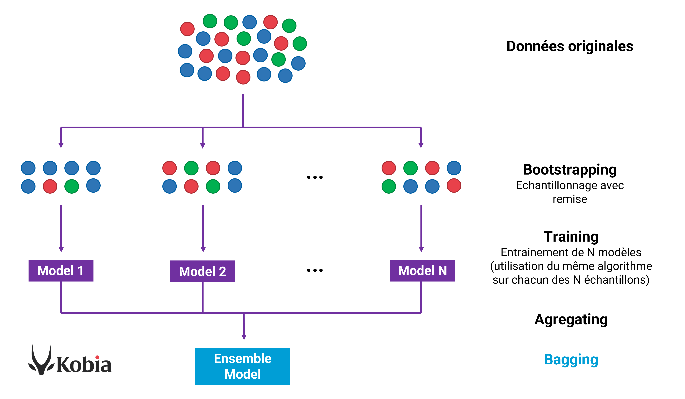

# Prédiction des Victoires dans Rainbow Six Siege 🎮

Ce projet est une application de prédiction qui utilise un **modèle d'ensemble d'arbres de décision** pour estimer si le nombre de victoires d'un joueur dans Rainbow Six Siege est supérieur ou inférieur à la médiane. L'usage d'un modèle d'ensemble améliore la précision et la robustesse en combinant les résultats de plusieurs arbres de décision.

## 🏆 Modèle Utilisé : Ensemble d'Arbres de Décision

Le modèle d'ensemble d'arbres de décision utilisé dans ce projet est une technique avancée de machine learning qui améliore la performance en combinant les prédictions de plusieurs arbres de décision individuels. Voici une explication détaillée de chaque étape du processus et des choix de paramétrage :

### Principe de l’Ensemble d'Arbres de Décision

Un arbre de décision unique peut être sensible aux variations des données d'entraînement, conduisant parfois à des erreurs dues au surapprentissage (overfitting) ou à la variabilité des prédictions. L'approche d’ensemble résout ce problème en combinant plusieurs arbres de décision indépendants, chacun construit sur un sous-échantillon différent de l’ensemble d’entraînement. Cela stabilise et renforce la précision des prédictions globales.

### Étapes du Modèle

1. **Échantillonnage Bootstrap** :
   - **Processus** : Pour chaque arbre, un échantillon aléatoire avec remise est extrait de l’ensemble d’entraînement. Cet échantillonnage avec remise signifie que certains échantillons peuvent être choisis plusieurs fois, tandis que d'autres peuvent être exclus du sous-échantillon.
   - **But** : Cette technique, connue sous le nom de "bagging" (Bootstrap Aggregating), permet de créer de la diversité parmi les arbres de l'ensemble. Un modèle plus diversifié est souvent plus robuste et moins sujet aux erreurs systématiques.
2. **Entraînement de chaque Arbre** :
   - **Structure de l'arbre** : Chaque arbre de décision est limité à une profondeur maximale de 5 niveaux, ce qui réduit la complexité de l'arbre et aide à éviter le surapprentissage. En restreignant la profondeur, chaque arbre est légèrement biaisé, mais ce biais est corrigé par le grand nombre d'arbres qui collaborent.
   - **Critère de décision** : Les arbres sont entraînés à partir des données bootstrap pour prédire une classification binaire (victoires au-dessus ou en-dessous de la médiane). Chaque arbre apprend à faire des choix basés sur les variables d’entrée, comme le nombre de kills, deaths, xp, etc., pour séparer les joueurs selon leur probabilité de surpasser la médiane des victoires.
3. **Prédiction par Vote Majoritaire** :
   - **Principe** : Une fois tous les arbres de l'ensemble entraînés, chaque arbre effectue une prédiction pour chaque échantillon en entrée (par exemple, les statistiques d'un joueur donné).
   - **Vote majoritaire** : Pour obtenir la prédiction finale, toutes les prédictions individuelles des arbres sont agrégées par vote majoritaire. Si la majorité des arbres prévoit que le nombre de victoires est au-dessus de la médiane, alors la prédiction finale est "au-dessus". Sinon, elle est "en-dessous".
   - **Avantage** : Cette méthode réduit l’impact des erreurs individuelles des arbres et renforce la stabilité des prédictions.
4. **Évaluation et Suivi des Performances** :
   - **Métriques de performance** : La précision (Accuracy) et le score F1 sont utilisés pour évaluer la qualité du modèle sur les ensembles d’entraînement et de test. La précision mesure la proportion de prédictions correctes, tandis que le score F1 équilibre la précision et le rappel pour évaluer les performances en classification binaire.
   - **Matrice de confusion** : Elle est utilisée pour analyser en détail la répartition des erreurs entre les classes "au-dessus" et "en-dessous", permettant de comprendre où le modèle réussit ou échoue.

### Schéma du Modèle





```
cssCopier le code[Collecte des Données]
      |
      v
[Échantillonnage Bootstrap]
      |       |
      |       v
      |  [Échantillon 1] ----> [Arbre de Décision 1]
      |       |
      |       v
      |  [Échantillon 2] ----> [Arbre de Décision 2]
      |       |
      |       v
      |  [Échantillon 3] ----> [Arbre de Décision 3]
      |
      v
   [Vote Majoritaire]
      |
      v
[Résultat Final : Au-dessus / En-dessous de la Médiane]
```

### Paramétrage du Modèle

- **Nombre d'arbres (`n_estimators`)** : 50 arbres ont été choisis après des tests de performance montrant qu’ils offraient un bon compromis entre robustesse et coût de calcul. Un nombre plus élevé d'arbres peut améliorer la précision mais augmente le temps de calcul.
- **Profondeur maximale (`max_depth`)** : Limité à 5 niveaux, ce choix empêche chaque arbre de s'adapter excessivement aux données d’entraînement, assurant que chaque arbre reste général et évite le surapprentissage.
- **Critère de construction des arbres** : Les arbres utilisent l’entropie ou le gini (selon le paramétrage choisi) pour mesurer l’impureté et déterminer les meilleures divisions à chaque nœud, optimisant ainsi les décisions des arbres.

### Comparaison des Prédictions avec les Valeurs Réelles

En utilisant un ensemble d'arbres de décision, le modèle atteint une **précision de 98% sur l'ensemble de test** et un **score F1 de 98%**, ce qui montre sa capacité à bien prédire la classe des victoires (au-dessus ou en-dessous de la médiane) avec peu d'erreurs. La matrice de confusion confirme l'efficacité du modèle avec un faible taux de faux positifs et de faux négatifs.

## 📊 Comparaison avec la Distribution des Valeurs

L’application inclut des visualisations par estimation de densité de probabilité (KDE) pour chaque variable d’entrée (kills, deaths, xp, etc.), permettant de comparer les valeurs de l’utilisateur avec la distribution des données globales.

## Données Utilisées

- **Source** : [Kaggle](https://www.kaggle.com/datasets/fahadalqahtani/tom-clancys-rainbow-six-siege)

### Variables :

- `kills` : Nombre de kills
- `deaths` : Nombre de morts
- `losses` : Nombre de défaites
- `xp` : Expérience accumulée
- `headshots` : Nombre de tirs à la tête
- `games_played` : Nombre de parties jouées
- `time_played` : Temps de jeu (en secondes)

## 📈 Évolution des Performances du Modèle

Un graphique montre l'évolution des scores de précision et F1 sur les ensembles d’entraînement et de test en fonction du nombre d'arbres. Ce suivi a permis d’optimiser le nombre d'arbres pour un compromis entre performance et coût de calcul.

## Lien vers l'Application

- Application en ligne : [RainbowSixPredictionApp](https://thomas454538-rainbowsixpredictionapp-app-2zgi96.streamlit.app)

## 🚀 Exécution

1. Charger les données et le modèle d’ensemble (`random_forest_model.joblib`) dans votre environnement de travail.
2. Exécuter `streamlit run app.py` pour démarrer l’application.